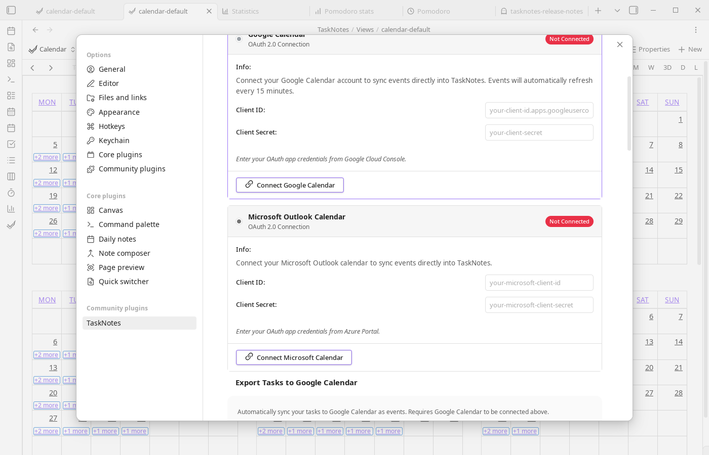

# Calendar Integration Setup

TaskNotes supports Google Calendar and Microsoft Calendar integration via OAuth 2.0.

## Setup (Your Own OAuth Credentials)

To connect calendars, create OAuth credentials with Google and/or Microsoft, then paste them into TaskNotes Integrations settings. The sections below walk through each provider.



### Google Calendar

<iframe width="560" height="315" src="https://www.youtube.com/embed/DzMN1Wu2P-g?start=210" title="How to set up Google Calendar OAuth" frameborder="0" allow="accelerometer; autoplay; clipboard-write; encrypted-media; gyroscope; picture-in-picture" allowfullscreen></iframe>

*Video by [@antoneheyward](https://www.youtube.com/@antoneheyward)*

In [Google Cloud Console](https://console.cloud.google.com), create or select a project, enable the Google Calendar API, and create OAuth 2.0 credentials using the Desktop application type. Then copy the Client ID and Client Secret into TaskNotes (`Settings -> TaskNotes -> Integrations`) and click **Connect Google Calendar**.

If your Google OAuth app is still in testing mode, add the Google account you will connect with under **Google Auth Platform -> Audience -> Test users**. Otherwise Google may block sign-in with a 403 `access_denied` error saying the app has not completed verification.

### Microsoft Calendar

In [Azure Portal](https://portal.azure.com), create an App Registration for your Microsoft account type. TaskNotes currently uses Microsoft's `common` OAuth authority, so the app registration must allow the account type you plan to connect through that authority. Tenant-specific single-tenant authorities are not configurable yet.

Under **Authentication**, add the **Mobile and desktop applications** platform and add this redirect URI:

```text
http://localhost
```

Also turn on **Allow public client flows**. TaskNotes uses a local loopback callback with a dynamic port, which Microsoft matches against the registered loopback URI.

If Azure does not accept the loopback redirect URI through the normal UI, configure loopback redirect support in the manifest by adding:

```json
{
  "url": "http://127.0.0.1",
  "type": "Web"
}
```

Next, add delegated Microsoft Graph API permissions (`Calendars.Read`, `Calendars.ReadWrite`, and `offline_access`) and grant consent when required by your organization. Copy the Application (client) ID into TaskNotes, then click **Connect Microsoft Calendar**. The client secret field can be left blank for public-client desktop setup.

## Security Notes

Credentials and tokens are stored locally in your Obsidian data. Tokens refresh automatically, calendar data syncs directly between your vault and provider, and you can disconnect at any time to revoke access.

## Troubleshooting

**"Failed to connect"**

Verify credentials first, then confirm loopback redirect configuration. TaskNotes uses a local callback on `127.0.0.1` with a dynamically selected port. For Microsoft, ensure loopback redirect support is configured in the app registration. Also confirm required permissions/scopes are granted.

For Google 403 `access_denied` errors during sign-in, confirm the account is listed as a test user in the Google Auth Platform audience settings while your OAuth app is in testing mode.

**"Failed to fetch events"**

Disconnect and reconnect to refresh OAuth tokens, then re-check provider-side calendar permissions.

**Connection lost after Obsidian restart**

Tokens should persist between sessions. If reconnection is required each restart, investigate vault or plugin-data file permissions.
